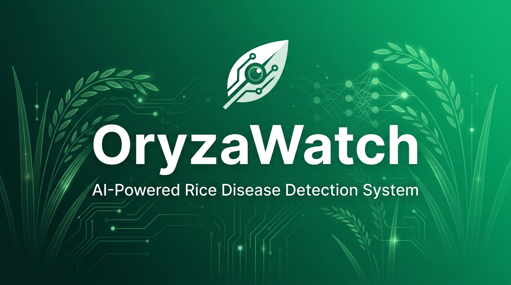

<div align="center">



# 🌾 OryzaWatch

**AI-Powered Rice Disease Detection & Farm Management System**

[](https://www.djangoproject.com/)
[](https://react.dev/)
[](https://expo.dev/)
[](https://pytorch.org/)
[](https://docs.docker.com/compose/)
[](https://www.mysql.com/)

*OryzaWatch* is a full-stack precision-agriculture platform that uses computer vision and deep learning to detect rice leaf diseases in the field — even without an internet connection.

</div>

---

## 🌿 What It Does

Farmers and agricultural field workers can **photograph a rice leaf** and get an instant AI-powered diagnosis — detecting:

| Disease | Code | Description |
|---|---|---|
| 🟢 **Healthy** | `HEALTHY` | No disease detected |
| 🟡 **Bacterial Leaf Blight** | `BLB` | Water-soaked lesions along leaf margins |
| 🔴 **Rice Blast** | `BLAST` | Diamond-shaped lesions with grey centers |

The system provides:
- **Classification** — disease name + confidence score + per-class probabilities
- **Grad-CAM heatmap** — visual explanation of *what* the AI looked at
- **Lesion segmentation** — pixel-level overlay of infected areas
- **Affected area ratio** — quantified severity (0–100%)
- **Lesion bounding boxes** — YOLO-detected lesion locations

---

## 🏗️ Architecture Overview

OryzaWatch is split into three cooperating sub-systems:

```
┌─────────────────────────────────────────────────────────────┐
│                        OryzaWatch                           │
│                                                             │
│  ┌──────────────┐   REST/JWT   ┌──────────────────────────┐ │
│  │  React Web   │ ◄──────────► │  Django Backend (API)    │ │
│  │  Dashboard   │              │  • User & Farm mgmt      │ │
│  │  (Vite/TSX)  │              │  • AI inference engine   │ │
│  └──────────────┘              │  • Weather analytics     │ │
│                                │  • MySQL + Media store   │ │
│  ┌──────────────┐              └──────────────────────────┘ │
│  │  React Native│ ◄──────────►        ▲                     │
│  │  Mobile App  │   REST/JWT          │ Upload              │
│  │  (Expo)      │                     │ (online)            │
│  │  + TFLite    │ ─── offline ─────► Local estimate        │
│  │  (on-device) │                                           │
│  └──────────────┘                                           │
└─────────────────────────────────────────────────────────────┘
```

### AI Model Stack

| Layer | Framework | Artifact | Purpose |
|---|---|---|---|
| **Primary classifier** | PyTorch (MobileNetV2) | `rice_leaf.pt` | Disease classification (authoritative) |
| **Fallback classifier** | Keras / TensorFlow | `rice_leaf.keras` | Fallback if PyTorch unavailable |
| **Mobile (offline)** | TensorFlow Lite | `rice_leaf.tflite` | On-device instant estimate — no signal needed |
| **Severity** | PyTorch U-Net | `rice_leaf_segmentation.pt` | Pixel-level lesion mask |
| **Lesion detector** | YOLOv8n | `rice_leaf_lesions.pt` | Bounding boxes per lesion blob |
| **Explainability** | Grad-CAM | *(reuses classifier weights)* | Heat-overlay showing AI focus region |

---

## 📁 Repository Structure

```
OryzaWatch/
├── oryzawatch_backend/      # Django REST API + AI pipeline
│   ├── ai_models/           # Trained model artifacts (.pt, .keras, .tflite)
│   ├── diagnostics/         # Leaf-scan endpoint & AI inference (ai.py)
│   ├── farms/               # Farm & field management
│   ├── analytics/           # Weather integration (Open-Meteo, no API key)
│   ├── alerts/              # Disease alert system
│   ├── users/               # JWT auth & user profiles
│   └── datasets/            # Training data (rice_leaf/ + rice_leaf_yolo/)
│
├── oryzawatch_frontend/     # React 19 + Vite web dashboard
│   └── src/
│       ├── views/           # Page-level components
│       └── components/      # Reusable UI components
│
├── oryzawatch_mobile/       # Expo React Native app
│   ├── src/
│   │   ├── screens/         # App screens (SubmitReport, etc.)
│   │   └── ml/              # On-device TFLite inference (leafModel.ts)
│   └── assets/model/        # Bundled .tflite + labels
│
├── docker-compose.yml       # One-command full-stack spin-up
└── pyproject.toml           # uv-managed Python workspace
```

---

## 🚀 Quick Start

### Option A — Docker Compose *(Recommended)*

> Spins up the frontend, backend, and database in one command.

```bash
# 1. Clone the repo
git clone https://github.com/XRIVANX/OryzaWatch.git
cd OryzaWatch

# 2. Configure environment variables
cp oryzawatch_backend/.env.example oryzawatch_backend/.env
# Edit .env with your DB credentials and Django SECRET_KEY

# 3. Launch all services
docker compose up --build
```

| Service | URL |
|---|---|
| 🌐 Web Dashboard | http://localhost:3000 |
| 🔌 Django API | http://localhost:8000 |
| 📱 Metro (Expo) | http://localhost:8081 |

---

### Option B — Local Development

#### 1. Backend (Django)

```powershell
# Install Python dependencies (uv-managed, from repo root)
uv pip install --python .\.venv\Scripts\python.exe -r oryzawatch_backend\requirements.txt

# CPU-only PyTorch:
uv pip install --python .\.venv\Scripts\python.exe torch torchvision --index-url https://download.pytorch.org/whl/cpu

# NVIDIA GPU (CUDA 12.x) — much faster training:
# uv pip install --python .\.venv\Scripts\python.exe --reinstall torch torchvision --index-url https://download.pytorch.org/whl/cu128

# Apply migrations and run
cd oryzawatch_backend
..\.venv\Scripts\python.exe manage.py migrate
..\.venv\Scripts\python.exe manage.py runserver
```

#### 2. Frontend (React + Vite)

```bash
cd oryzawatch_frontend
npm install
npm run dev        # http://localhost:5173
```

#### 3. Mobile App (Expo)

```bash
cd oryzawatch_mobile
npm install

# Expo Go (online features only — no offline AI):
npx expo start

# Native build required for on-device AI:
npx expo run:android

# Or via EAS Cloud Build (no local Android Studio needed):
eas build --profile development --platform android
```

---

## 🤖 Training the AI Models

> All training commands run from `oryzawatch_backend/` using the repo-root virtualenv.

```powershell
$py = "..\.venv\Scripts\python.exe"   # shorthand

# Step 1 — Add training images
#   datasets/rice_leaf/train/{healthy,blb,rice_blast}/

# Step 2 — Held-out validation split (15%)
& $py manage.py split_dataset --ratio 0.15

# Step 3 — Train primary PyTorch classifier
& $py manage.py train_leaf_torch

# Step 4 — Train Keras fallback (also source for mobile TFLite)
& $py manage.py train_leaf_model

# Step 5 — (Optional) Lesion segmentation U-Net
& $py manage.py train_leaf_segmentation

# Step 6 — (Optional) YOLOv8 lesion detector
& $py manage.py build_yolo_dataset
& $py manage.py train_leaf_yolo

# Step 7 — Export to TFLite → auto-copied to mobile assets
& $py manage.py export_tflite
```

> **Grad-CAM explainability** requires no extra training step — it uses `rice_leaf.state.pt` (saved by Step 3) automatically.

---

## 📡 API Reference

### Scan a Leaf

```http
POST /api/diagnostics/upload/
Authorization: Bearer <JWT>
Content-Type: multipart/form-data

image=<file>   latitude=<float>   longitude=<float>
```

**Response:**

```jsonc
{
  "detected_disease": "BLAST",
  "confidence_score": 0.94,
  "probabilities": { "BLB": 0.03, "HEALTHY": 0.03, "BLAST": 0.94 },

  // Populated only once optional models are trained:
  "heatmap": "/media/heatmaps/scan_42.jpg",         // Grad-CAM overlay
  "segmentation_mask": "/media/masks/scan_42.png",  // Lesion highlight
  "affected_area_ratio": 0.17,                       // 17% of leaf affected
  "lesion_boxes": [
    { "class": "blast_lesion", "confidence": 0.88,
      "x": 0.30, "y": 0.40, "w": 0.10, "h": 0.08 }
  ]
}
```

> All AI-derived fields are **read-only** — clients cannot forge a diagnosis.  
> Missing optional models return `null` for their fields and never fail the upload.  
> No classifier trained? → HTTP `503` with setup instructions.

---

## 📱 Offline Mode

The mobile app bundles `rice_leaf.tflite` and runs inference **fully on-device** using [`react-native-fast-tflite`](https://github.com/mrousavy/react-native-fast-tflite).

- A farmer with **no signal** gets an instant estimate before uploading.
- The Django backend **always re-runs** inference on upload — the server result is authoritative.
- The on-device result is advisory and is **never sent** to the server as a diagnosis.

> Offline AI requires a **native build** — it does not run in Expo Go.  
> See [`OFFLINE_AI.md`](./oryzawatch_mobile/OFFLINE_AI.md) for the full build guide.

---

## 🧰 Tech Stack

| Layer | Technology |
|---|---|
| **Backend** | Django 6.0, Django REST Framework, SimpleJWT, Gunicorn |
| **Database** | MySQL 8.0 |
| **AI — Primary** | PyTorch, TorchScript, MobileNetV2, U-Net (`segmentation-models-pytorch`), YOLOv8 (Ultralytics) |
| **AI — Fallback / Mobile** | TensorFlow CPU, Keras, TFLite, `react-native-fast-tflite` |
| **Explainability** | Grad-CAM (hooks MobileNetV2's last conv block) |
| **Frontend** | React 19, Vite 8, TypeScript, Leaflet (interactive maps), Open-Meteo |
| **Mobile** | Expo SDK, React Native (New Architecture enabled), EAS Build |
| **Infra** | Docker Compose, Nginx, WhiteNoise |
| **Dev Tooling** | uv (Python), ESLint, EAS CLI |

---

## 🗺️ Roadmap

- [ ] Push notifications for disease outbreak alerts
- [ ] Multi-language support (Filipino / regional languages)
- [ ] Regional disease heatmap dashboard
- [ ] Automated dataset retraining pipeline (CI trigger)
- [ ] iOS native build via EAS Cloud
- [ ] TFLite quantization for reduced app size (~2 MB vs ~8 MB)

---

## 📄 License

This project is for academic and research purposes.

---

<div align="center">

Made with 💚 for Filipino rice farmers

**OryzaWatch** — *Oryza sativa* + Watch

</div>
